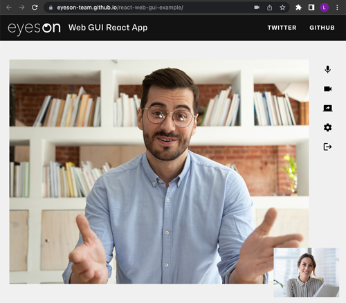
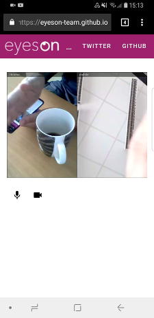

# eyeson Web GUI build with React

A minimal web gui for video meetings using [eyeson]. The application
demonstrates a very simple interface for [eyeson] team video meetings and can
be used to host or integrate videos in any software. Create your own [api key]
and enhance your products with powerful video meetings.

Find the build project at [eyeson-team.github.io/react-web-gui-example].

```
$ yarn # install dependencies
$ yarn start # start local application at http://localhost:3000/
$ yarn build # build for production
$ yarn deploy # deploy to github pages (adapt homepage of package.json)
```




This project was bootstrapped with [Create React App].

[eyeson]: https://eyeson.team/ "eyeson Video Meetings"
[api key]: https://accounts.eyeson.team/projects "eyeson Team API Key"
[eyeson-team.github.io/react-web-gui-example]: https://eyeson-team.github.io/react-web-gui-example/
[Create React App]: https://github.com/facebookincubator/create-react-app
